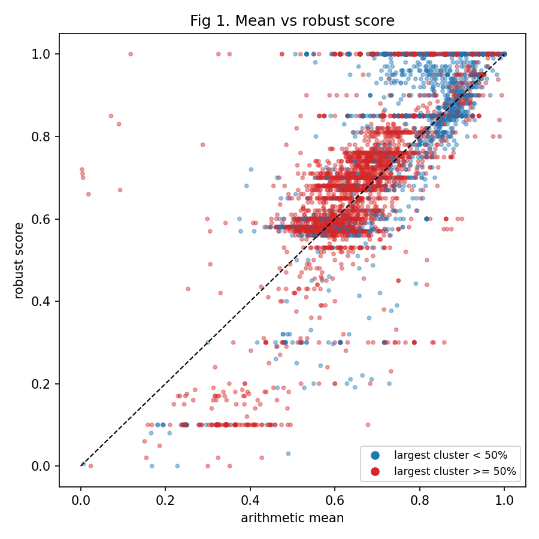
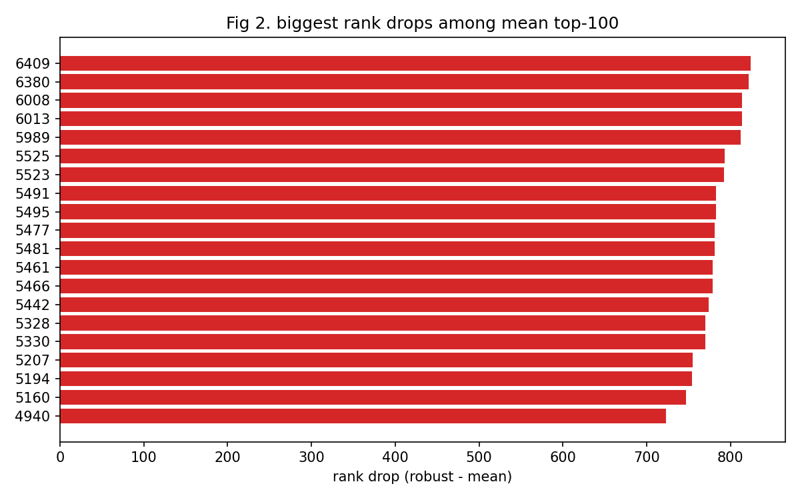
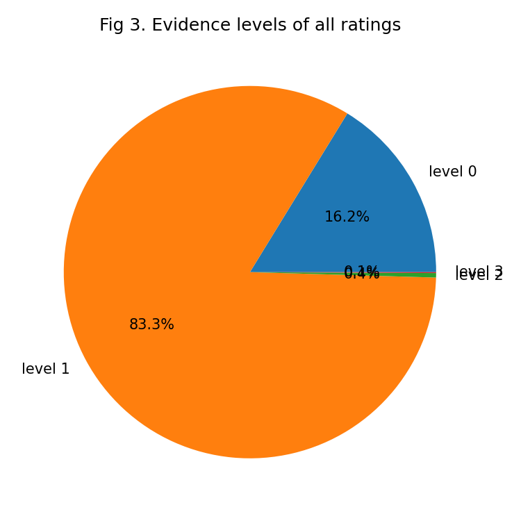
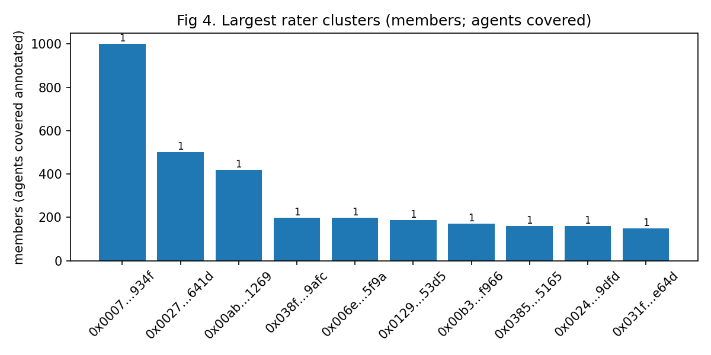
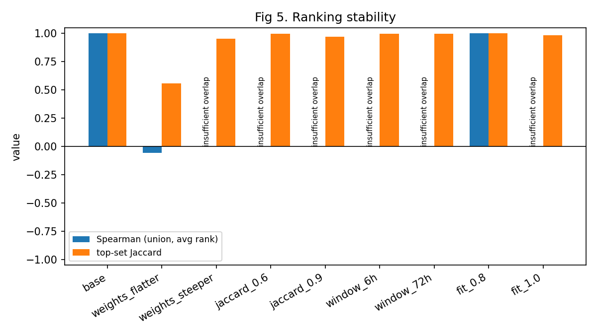

# Robust reputation on ERC-8004 (Base)

Data cut at block 51322403. Ratings: 476234 (87 revoked, excluded below). Agents rated: 29729. Agents scored (>= min_clusters independent clusters): 4964; insufficient (too few clusters): 24765.

## Headline numbers
- No evidence URI (level 0): 16.2%
- No verifiable interaction evidence (levels 0-1): 99.5%. This is comparable to the study's (arXiv 2606.26028) reported 98.7-100% of ratings with no interaction evidence.
- Verified on chain (level 3): 0.1%
- Agents flagged (largest single cluster >= 50% of that agent's records, among scored agents only): 3292 (66.3%)
- Read `sybil_flag` together with `n_clusters` and `zero_evidence_ratio`: in scenario F an attack split across two funders held 91% of the records while the largest single cluster was 45%, leaving the flag at 0.
- Rater concentration: 13421 distinct raters, 476234 ratings (1.0 median, 44666 max ratings per rater). With repeat raters this dense, the largest-single-cluster flag is mostly single-rater dominance (one address rating the same agent many times); read it with `n_raw` and `n_clusters`.
- Tag hygiene: 631 distinct tags; 0.2% of records carry a tag with fewer than 10 records overall. tag1 is free text on ERC-8004; many values are sentences rather than categories. v0.1 keeps every tag as its own group; a rare-tag merge is a v0.2 item.
- Median |mean - robust| among scored agents: 0.062

## Figures
### Fig 1. Mean vs robust score

### Fig 2. Biggest rank drops

### Fig 3. Evidence levels

### Fig 4. Largest rater clusters

### Fig 5. Ranking stability

## Sensitivity
Rank stability of the top-N robust-score ranking under reasonable parameter perturbations (evidence-weight shape, sybil Jaccard threshold, sybil time window, normalization fit share), each vs the base configuration. Top sets are tie-inclusive (every agent scoring >= the N-th highest score). `top_set_jaccard` is the primary stability measure: the overlap of the base and variant top sets. Spearman's rho (Pearson correlation of average ranks over the union of the two top sets, no scipy dependency) is reported for completeness; a blank cell means one run ranked the whole union as a single tie while the other did not (zero variance on one side, so no correlation is defined).
1110 of the 4964 scored agents tie at the top score (1.000), against a base top set of 1110. The top set is essentially one tie block in which every member holds the same rank, and Spearman's rho is therefore uninformative on this data: any value is driven by the few agents outside the block, and a value near 0 reflects tie order, not a ranking change. Read `top_set_jaccard`.
A variant whose `budget_limited` is True hit a sybil pair budget while clustering (each variant re-clusters from scratch, and a wider sybil window generates more candidate pairs), so its row may reflect the budget rather than the parameter being varied; compare it against the base row's own `budget_limited`.

| variant         |   spearman_union |   spearman_top |   top_set_jaccard |   top_set_size | budget_limited   |
|:----------------|-----------------:|---------------:|------------------:|---------------:|:-----------------|
| base            |        1         |      1         |          1        |           1110 | True             |
| weights_flatter |       -0.0553482 |     -0.0553482 |          0.559428 |            635 | True             |
| weights_steeper |                  |                |          0.951973 |           1166 | True             |
| jaccard_0.6     |                  |                |          0.997297 |           1107 | True             |
| jaccard_0.9     |                  |                |          0.97028  |           1144 | True             |
| window_6h       |                  |                |          0.998201 |           1112 | True             |
| window_72h      |                  |                |          0.999099 |           1109 | True             |
| fit_0.8         |        1         |      1         |          1        |           1110 | True             |
| fit_1.0         |                  |                |          0.981982 |           1090 | True             |

## Adversarial evidence
Known-answer attack scenarios (see `robustrep.report.adversarial.scenario_table`), each computed with **bootstrap_n=0**: point estimates only -- no confidence-interval claims are made from this table.

| scenario              |   naive_mean |   robust_score |   n_clusters |   sybil_flag |   zero_evidence_ratio |   break_even_k |   break_even_k_boost |
|:----------------------|-------------:|---------------:|-------------:|-------------:|----------------------:|---------------:|---------------------:|
| A_boosting            |    0.981818  |            0.8 |            6 |            1 |              0.909091 |                |                      |
| B_smearing            |    0.0727273 |            0.8 |            6 |            1 |              0.909091 |                |                      |
| C_value_poisoning     |    0.5175    |            0.5 |           20 |            0 |              0        |                |                      |
| D_evidence_free_flood |    0.16      |            0.8 |           25 |            0 |              0.8      |                |                      |
| E_fresh_tag           |    0.385714  |            0.9 |            7 |            0 |              0.571429 |                |                      |
| F_split_funders       |    0.981818  |            0.8 |            7 |            0 |              0.909091 |                |                      |
| H_evasive_k20         |    0.16      |            0.8 |           25 |            0 |              0.8      |                |                      |
| G_smear_breakeven     |    0.0818182 |            0   |           33 |            0 |              0.909091 |             30 |                      |
| G2_boost_breakeven    |    0.991176  |            1   |           34 |            0 |              0.911765 |             31 |                      |
| H_evasive_breakeven   |    0.1       |            0   |           40 |            0 |              0.875    |             35 |                   36 |

**Measured boundaries.** Against 3 level-3 honest votes (mass 3.0), a smear campaign flips the score at k=30 evidence-free raters (the exact tie), a boost needs 31. Against 5 level-2 honest votes (mass 3.5) under the evasive pattern, smear flips at 35, boost at 36; `sybil_flag` stays 0 throughout while `zero_evidence_ratio` is 0.88-0.91.

## Method
normalize per (tag, scale) -> evidence weights -> sybil collapse (2-of-3 signals: shared funder, first-seen within the sybil time window, Jaccard-similar ratee sets) -> one vote per (ratee, tag, cluster) -> per-tag weighted median, weighted across tags by summed evidence mass -> bootstrap CI. See the design spec in the parent repo.

**Attacker break-even.** An attacker needs to command roughly half of the evidence mass behind a ratee's votes to move the weighted median at all -- not half the vote count. Exact ties resolve **downward**, toward the lower of the two tied values: a smearing attack that reaches exactly half the evidence mass succeeds at that tie, while a boosting attack needs to strictly exceed half (one more unit of mass) to flip the score, since at the tie the lower (honest) value is the one selected.

**Flat-weight fallback.** With flat (all-equal) evidence weights, the aggregator reduces to the **lower weighted median** of the votes, not numpy's mean-of-two-middles convention: for an even split of evidence mass on either side, the smaller of the two middle values is reported, never their average.

## Limitations
- **Clustering evasion.** An attacker using a distinct funder per rater, spacing first-seen timestamps more than the sybil time window apart, and rating decoy ratees can still reach a Jaccard of 1.0 with another attacker who shares the same decoy -- but that pair still evades detection, because it fails both of the other two signals (distinct funders, and outside the time window), so no pair ever reaches 2 of the 3 required signals. Every attacker rater lands in its own singleton cluster. The residual defense is evidence weighting (an evasive farm is almost always evidence-free): `zero_evidence_ratio` is the signal that survives this evasion even when `sybil_flag` reads 0 and rater clustering sees nothing unusual.
- **Large-ratee-group blind spot.** A ratee with more raters than `sybil_max_group` is skipped entirely for ratee-based blocking (see `robustrep.sybil`), so a farm concentrated on one very popular ratee can evade the ratee-sharing signal by sheer volume, independent of the evasion technique above.
- **Budget-limited clustering.** Sybil clustering was budget-limited: 1 ratee block(s) skipped for size (> sybil_max_group), 1 for the per-ratee pair budget, global pair budget reached: no (671293 candidate pairs examined, 600270 tested). Clusters among the affected raters may be under-merged, so their ratees' scores are less robust than reported, never more.
- **DNS rebinding in the evidence fetcher (the residual unmitigated gap in v0.1).** The SSRF guard resolves an evidence URI's host and checks *those* addresses, but `requests`/`urllib3` resolve the host again independently; a rebinding attacker answering a public address on the first lookup and a private one on the second can pass the guard and cause a GET to a private address. The blast radius is not nil: the fetched text is consumed by the tx-hash scan and the per-URI outcome is persisted, so a bypass is at least a four-state oracle about the target (no response; a response with no markers; a 0x-hash or task-id key present; a hash involving the rater/owner addresses -- and further states as other notes are recorded, e.g. `fetch-error` or `lookup-budget:N`) -- not a blind request. That is precisely why the URL is parser-cross-checked (`urlsplit` against `urllib3`), host-allowlisted to LDH labels, and rebuilt canonically from the vetted components before it is fetched: "nothing of the response is persisted or reported" would not be reason enough to tolerate a reachable bypass -- and here it is not even true, since the `(level, note)` pair is both. Closing the remaining DNS gap (resolve once, then fetch through a pinned-IP transport adapter) is a v0.2 item. See `robustrep.sources.evidence_fetch` for the full writeup and its xfail regression test.
- **Two-tag lower-median bias.** With exactly two tags, cross-tag combination is a step, not a blend: the reported score is whichever tag's median holds at least half the total evidence mass; the other tag is discarded. At an exact mass tie (within a 1e-9 relative tolerance) the lower-scored tag wins by the same lower-median convention. The deviation from a blended estimate is bounded by the gap between the two tag medians and is downward only at the tie.
- **Unique-tag gaming.** `tag1` is attacker-chosen free text and v0.1 keeps every distinct value as its own normalization group, so a rater who invents a tag nobody else uses gets a group of one: at `d0` a posted `1` fits the absolute `binary` rule and normalizes straight to 1.0, with no honest record in the group to normalize against (the scale buys nothing either -- the attacker picks that too, and a `100` at `d2` is the same 1.0). What that buys is bounded, not free. A tag reaches the reported score only through the cross-tag weighted median, and a tag's weight there is the SUM of its votes' evidence weights, not their count -- so an evidence-free invented tag carries ~0.1 per (ratee, tag, cluster) vote, not per rating: collapse gives each cluster one vote carrying its records' mean weight, so a hundred ratings from one cluster are still ~0.1. A top-scoring invented tag can take over the ratee's score only once the honest tags together hold less than half the ratee's total evidence mass. The cost is paid in evidence mass, which is the quantity the whole aggregator is built to make expensive; a rare-tag merge is a v0.2 item.
- **Evidence lookup budget.** Verifying an evidence URI's transaction hashes is bounded twice, and both bounds can only hide a real level 3, never invent one. A run-wide budget (`evidence_max_total_lookups`) cuts verification short once it is spent: each URI it caught is cached with a `lookup-budget:N` note and counted as `evidence_lookup_starved_uris` in Provenance, its level is a possible **false negative**, and the level-3 share reported above is therefore biased downward, never upward. A later `fetch` retries those URIs, up to `MAX_LOOKUP_ATTEMPTS` attempts each (see `robustrep.sources.evidence_batch`), after which the starved level stands. The second bound is per URI: only the first 8 distinct hashes in a document are ever looked up, and that truncation happens silently -- no note, no counter -- so a document carrying more hashes than that can be under-levelled without ever appearing in the count above.
- **Normalization precedes sybil collapse.** Rule selection runs per (tag, scale) group over the raw records, before clustering collapses a farm into one vote (see the Method order above). So a farm the clusterer handles perfectly -- every member merged, a single vote between them -- can still have forced a rung change on the way in (percent -> `rank`, say) by pushing its group past the outlier tolerance, re-levelling every honest record in that group; the collapse happens afterwards and cannot undo a rung already chosen. The tolerance (`max(1, floor(n * (1 - norm_fit_share)))` records allowed outside a rule's range -- see `robustrep.normalize`) is the only defense at that stage. `norm_rule_counts` in Provenance is the signal it leaves: diff it run over run and a rung flip shows up as a plain diff.

## Provenance
- Rater profile mode: blockscout
- Confirmations lag (data cut is final as of this block): 20
- Scoring configuration used:
  - `bootstrap_n`: 1000
  - `bootstrap_seed`: 0
  - `min_clusters`: 3
  - `evidence_weights`: [0.1, 0.3, 0.7, 1.0]
  - `sybil_jaccard`: 0.8
  - `sybil_window_s`: 86400
  - `sybil_max_group`: 2000
  - `sybil_max_pairs`: 5000000
  - `sybil_max_pairs_per_ratee`: 500000
  - `sybil_flag_share`: 0.5
  - `norm_fit_share`: 0.9
  - `norm_rule_counts`: {'binary': 331878, 'percent': 142116, 'rank': 1978, 'unit': 163, 'constant': 12}
  - `evidence_level_shares`: {0: 0.16237842515021622, 1: 0.8329759507042993, 2: 0.0038433508979369814, 3: 0.0008022732475475011}
  - `evidence_max_lookups_per_uri`: 8
  - `evidence_max_total_lookups`: 20000
  - `evidence_lookup_starved_uris`: 0
- Versions: robustrep 0.1.1, python 3.10.9, numpy 2.2.6, pandas 2.3.3, matplotlib 3.10.9, requests 2.34.2, urllib3 2.7.0, eth_abi 6.0.0